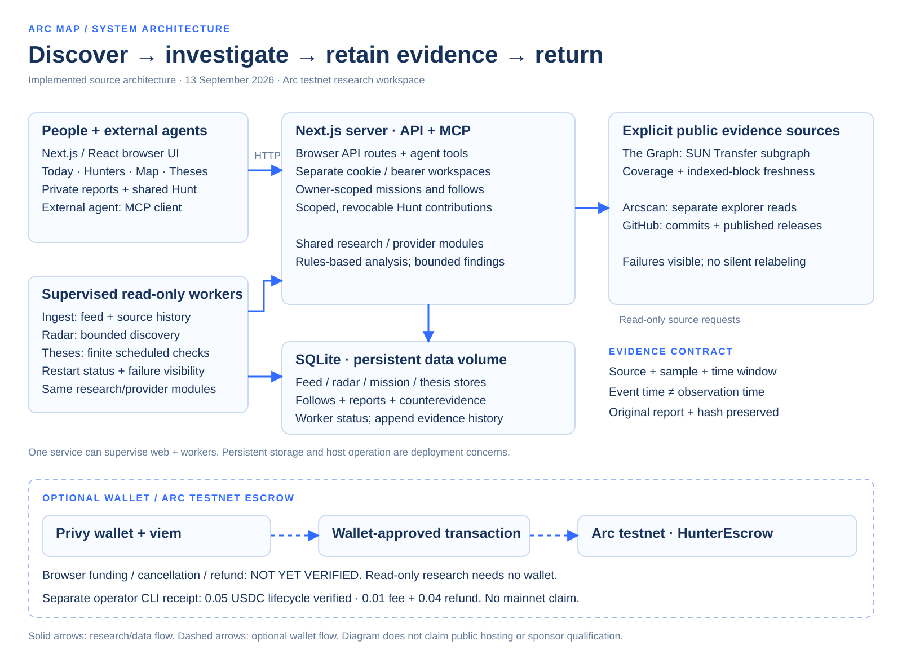

# ARC MAP architecture

Source baseline: `8245cddcd2e367b02860da9471463de06e0c8dd5`, 13 September 2026.

The Next.js/React browser and external MCP clients use server research routes. Browser cookies and agent bearer tokens identify separate private workspaces. Completed Hunts can be shared through one-use contributor invitations; revocation blocks future access while retaining sourced counterevidence and the original report/hash.

API handlers and supervised read-only workers share research/provider modules. Ingest collects source history, radar collects bounded discovery, and thesis workers run finite scheduled checks. SQLite stores retain observations, source health, follows, missions, theses and worker status on a persistent data volume. The single-service runtime supervises the web and worker processes; this describes the implementation, not a live hosting claim.

The Graph SUN Transfer subgraph is an explicit provider with coverage and indexed-block freshness checks. Arcscan explorer queries and GitHub repository/release queries remain separate sources. A source failure cannot silently become another provider's evidence. Reports retain source, sample, time window and uncertainty; event dates and observation dates are distinct.

Privy wallet connection and viem transaction preparation form an optional path to the Arc-testnet-only HunterEscrow. Browser funding, cancellation and refund remain unverified. Separately, the operator-controlled CLI testnet lifecycle completed with a 0.05 USDC research budget, 0.01 fee and 0.04 refund. No wallet is needed for read-only discovery and research. No mainnet or public-host operation is asserted.

## Code map

- Browser: `src/components/workspace.tsx`, `src/components/daily-brief.tsx`, `src/components/thesis-desk.tsx`.
- API and MCP: `src/app/api/`, `src/lib/mission-access.ts`, `src/lib/mission-store.ts`.
- Read-only workers: `scripts/workers.ts`, `scripts/ingest.ts`, `scripts/radar.ts`, `scripts/thesis-worker.ts`.
- Single-service lifecycle: `scripts/serve-all.mjs`.
- SQLite persistence: `src/lib/feed-store.ts`, `radar-store.ts`, `mission-store.ts`, `follow-store.ts`, `thesis-store.ts`, `release-store.ts`.
- Graph schema: `subgraphs/arcmap/schema.graphql`.
- Wallet and escrow boundaries: `docs/HUNTER-EXECUTION.md`, `contracts/src/HunterEscrow.sol`.

This diagram is native SVG, rendered to PNG for the submission. It contains no credentials, private transcripts, private notes or internal assignment text.
